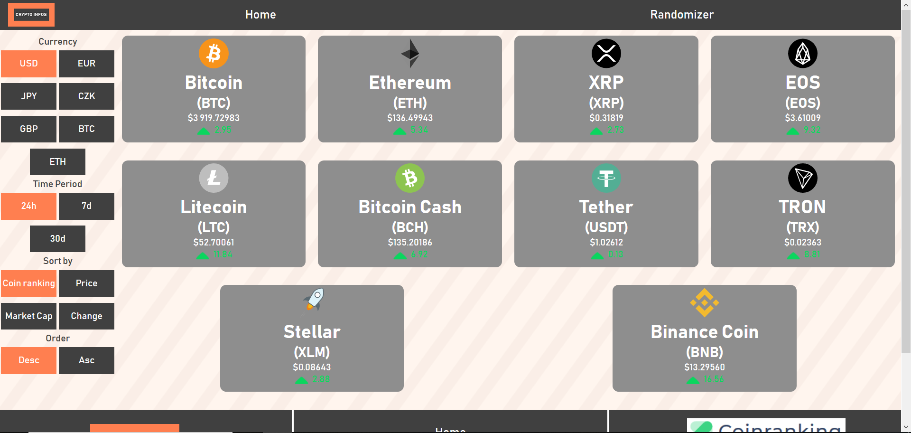
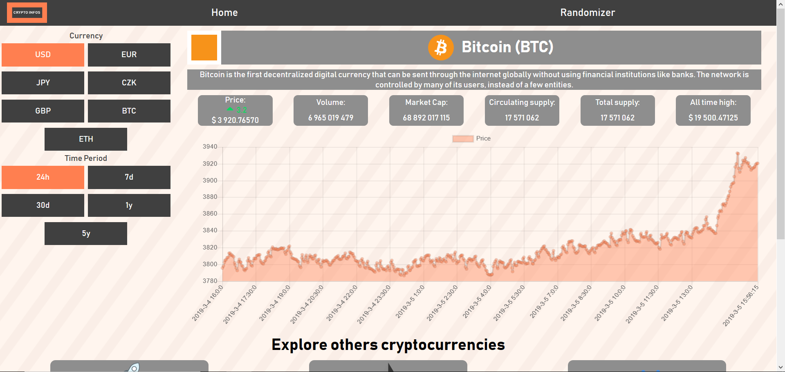
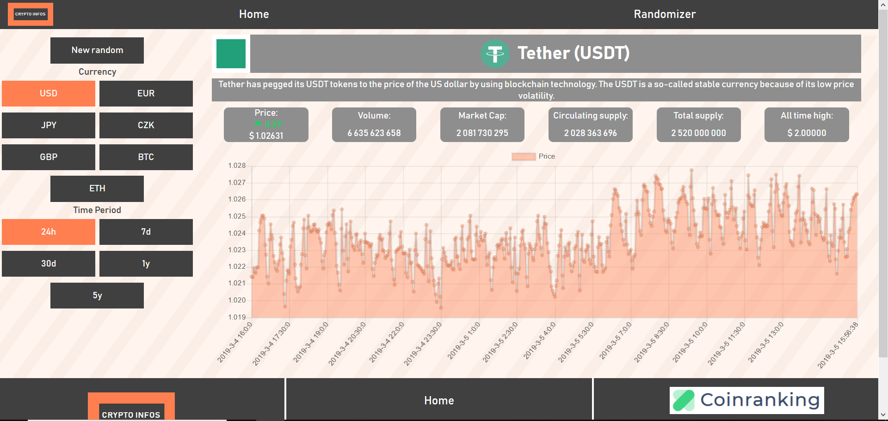

# Crypto Infos

[https://cryptoinfo.bghinc.fr/](https://cryptoinfo.bghinc.fr/)

### Website created to discover Vuejs framework.

Initially with .js files only.
With Vue Cli since September 8th 2019.

PWA application since September 8th 2019.

Display information about cryptocurrencies.

### Index page

 

### Details page

 

### Randomizer page

 
